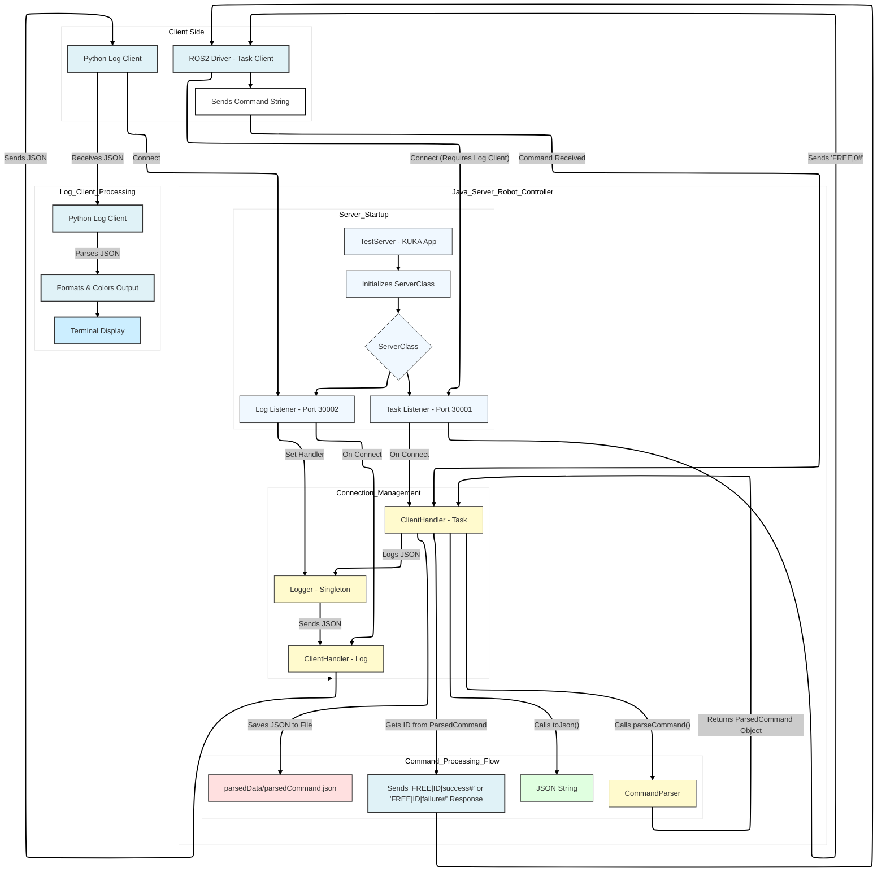

# iiwaTOFAS

A TCP/IP-based control system for KUKA iiwa robots, designed to work with the KUKA Sunrise controller. This project provides a robust communication framework that allows external clients (like ROS2 drivers) to send motion commands and receive real-time logging information from the robot.

## What This Does

This is a server application that runs on the KUKA robot controller and handles three types of connections:
- **Task Port (30001)**: Receives motion commands and control instructions
- **Log Port (30002)**: Broadcasts JSON-formatted logging data in real-time
- **Joint State Port (30003)**: Broadcasts real-time joint position data to connected clients

Think of it as a bridge between your robot control software and the KUKA hardware. Commands come in as simple string messages, get parsed into robot motions, and everything that happens gets logged back to you. Joint state data is continuously broadcast to all connected clients for monitoring and control feedback.

## Features

- Multi-threaded TCP server running on the KUKA Sunrise controller
- Support for various motion types (PTP, LIN, CIRC movements)
- Both joint-space and Cartesian-space motion commands
- Continuous motion support for smooth trajectories
- Digital and analog I/O control
- **Tool support:** Proper KUKA Tool API integration for accurate TCP motion control (optional)
- **Centralized logging system:**
  - Single LoggingServerManager broadcasts to all clients
  - Real-time network broadcast to multiple Python log clients (port 30002)
  - Robot console output via RobotConsoleClient (all logs from all tasks appear on SmartPad)
  - Background tasks can log to robot console through the centralized architecture
- **Real-time joint state broadcasting to multiple clients (port 30003)**
- Command validation and error handling
- Session management with unique client IDs
- Automatic command history saved to `parsedData/parsedCommand.json`
- Robust exception handling - errors don't crash the system
- Clean single-responsibility architecture: one server, one port, one function

## Architecture

The system uses a multi-port architecture with three dedicated server managers, each following the single responsibility principle:
- **Port 30001**: Task commands (Ros2ServerManager)
- **Port 30002**: Log data broadcasting (LoggingServerManager)
- **Port 30003**: Joint state data (JointStateServerManager)

### Logging System Architecture

The logging system uses a centralized hub-and-spoke architecture:

1. **Logger (Singleton)**: Central hub that receives log messages from all tasks
2. **LoggingServerManager**: Background task that:
   - Receives messages from Logger via queue
   - Broadcasts to all connected network clients (Python log clients)
   - Listens on port 30002
3. **RobotConsoleClient**: Runs in CommandExecutor (foreground task) and:
   - Connects as a client to LoggingServerManager
   - Receives log messages and displays them on robot console via println
   - Only foreground tasks can write to robot console, hence this design

**Key Benefits:**
- All logs from all tasks (foreground and background) appear on robot console
- Multiple Python clients can simultaneously receive logs
- Single responsibility: one server, one port, one function
- Background tasks can indirectly log to robot console via the forwarding mechanism

**Log Flow:**
```
Background Task → Logger → LoggingServerManager → Network Clients (Python)
                                ↓
                        RobotConsoleClient (in CommandExecutor) → Robot Console (println)
```



## Getting Started

### Requirements

- KUKA iiwa robot with Sunrise.Workbench
- Java Development Kit (JDK) compatible with KUKA Sunrise
- Python 3.x (for the client utilities)
- Network connectivity between your control machine and the robot

### Setting Up the Server

1. Import this project into Sunrise.Workbench
2. Configure your robot's IP address in the network configuration
3. Deploy the application to your KUKA controller
4. The server will automatically start listening on:
   - Port 30001 (task commands)
   - Port 30002 (logging)
   - Port 30003 (joint state broadcasting)

### Running the Python Clients

There are three Python utilities in the `pythonUtils/` directory:

**Log Client** (start this first):
```bash
python pythonUtils/log_client.py
```

The log client displays color-coded messages based on severity:
- 🟢 **INFO** (Green): Normal operation messages
- 🟡 **WARN** (Yellow): Warnings and recoverable issues
- 🔴 **ERROR** (Red): Errors and failures

Message format: `[timestamp] [LEVEL] [tag] message`

**Task Client** (for testing commands):
```bash
python pythonUtils/task_client.py
```

**Joint State Client** (for receiving real-time joint positions):
```bash
python pythonUtils/joint_state_client.py
```

You'll need to update the `SERVER_IP` in all files to match your robot's IP address.

### Receiving Joint State Data

To receive real-time joint state data from the robot, connect to port 30003. The robot broadcasts joint positions at 100Hz (10ms intervals) in the following format:

```
J1;J2;J3;J4;J5;J6;J7#
```

Where J1-J7 are the joint angles in degrees. Example Python client:

```python
import socket

SERVER_IP = "10.66.171.147"  # Robot IP
JOINT_STATE_PORT = 30003

sock = socket.socket(socket.AF_INET, socket.SOCK_STREAM)
sock.connect((SERVER_IP, JOINT_STATE_PORT))

while True:
    data = ""
    while True:
        char = sock.recv(1).decode()
        if char == '#':
            break
        data += char
    
    joints = data.split(';')
    print(f"Joint positions: {joints}")
```

Multiple clients can connect simultaneously to receive joint state updates.

## Command Protocol

Commands are sent as pipe-delimited strings ending with `#`. Here's the complete format:

```
ACTION_TYPE|NUM_POINTS|TARGET_POINTS|IO_POINT|IO_PIN|IO_STATE|TOOL_ID|BASE|SPEED_OVERRIDE|ID#
```

**Tool ID Field** (index 6): Specifies which tool to use for the motion
- 0 = Flange (no tool)
- 1 = GimaticCamera
- 2 = Vacuum1
- 3+ = Other tools (see ToolMapping.java)

### Supported Motion Types

| Action Type | Description | Value |
|------------|-------------|-------|
| PTP_AXIS | Point-to-point in joint space | 0 |
| PTP_FRAME | Point-to-point in Cartesian space | 1 |
| LIN_AXIS | Linear motion in joint space | 2 |
| LIN_FRAME | Linear motion in Cartesian space | 3 |
| CIRC_AXIS | Circular motion in joint space | 4 |
| CIRC_FRAME | Circular motion in Cartesian space | 5 |
| PTP_AXIS_C | Continuous PTP in joint space | 6 |
| PTP_FRAME_C | Continuous PTP in Cartesian space | 7 |
| LIN_FRAME_C | Continuous linear in Cartesian space | 8 |

### Example Commands

Move to joint position with flange (all angles in degrees):
```
0|1|0.0;10.0;-5.0;20.0;0.0;-15.0;0.0|||0||0.2|cmd_001#
```

Move to Cartesian position with Vacuum1 (tool ID 2):
```
1|1|400.0;0.0;600.0;180.0;0.0;180.0|||2||0.15|cmd_002#
```

Linear motion with GimaticCamera (tool ID 1):
```
3|1|400.0;100.0;550.0;180.0;0.0;180.0|||1||0.1|cmd_003#
```

### I/O Commands

#### Command 9: ACTIVATE_IO - Set Digital Output

Sets the state of a digital output pin.

**Format:**
```
9|0|0|0|PIN_NUMBER|STATE|0|0|0|ID#
```

**Parameters:**
- `PIN_NUMBER`: IO pin index (1-88)
  - 1-64: Virtual marks (software flags)
  - 65-72: Ethercat outputs (Output1-Output8)
  - 73-80: IOFlange outputs (DO_Flange1-DO_Flange8)
  - 81-88: MediaFlange outputs
- `STATE`: true or false

**Response:**
```
FREE|ID|success#  (on success)
FREE|ID|failure#  (on failure)
```

**Example:**
```
9|0|0|0|65|true|0|0|0|cmd_io1#    # Set Ethercat Output1 to HIGH
9|0|0|0|1|false|0|0|0|cmd_io2#    # Set virtual mark 1 to LOW
```

#### Command 12: DIGITAL_INPUT - Read Digital Input

Reads the state of a digital input pin.

**Format:**
```
12|0|0|0|PIN_NUMBER|0|0|0|0|ID#
```

**Parameters:**
- `PIN_NUMBER`: Input pin index (1-86)
  - 1-64: Virtual marks (software flags)
  - 65-72: Ethercat inputs (Input1-Input8)
  - 73-80: IOFlange inputs (DI_Flange1-DI_Flange8)
  - 81-86: MediaFlange inputs

**Response:**
```
FREE|ID|1#  (if input is HIGH/true)
FREE|ID|0#  (if input is LOW/false)
FREE|ID|failure#  (on error)
```

**Example:**
```
12|0|0|0|65|0|0|0|0|cmd_input1#   # Read Ethercat Input1
```

#### Command 13: ANALOG_INPUT - Read Analog Input

Reads an analog input value (not yet implemented).

**Format:**
```
13|0|0|0|PIN_NUMBER|0|0|0|0|ID#
```

**Response:**
```
FREE|ID|failure#  (not implemented)
```

**Testing:**

Use the provided test script to test IO commands:
```bash
cd pythonUtils
python3 test_io_commands.py [robot_ip]
```

### Program Call Commands

Program call commands execute predefined subroutines like tool picking and placing operations. The action type for program calls is 100 + program ID.

#### Pick Tool Operations (Program IDs 1-3)

Picks up a tool from its storage base using a standardized motion sequence.

**Format:**
```
101|0|0|0|0|0|0|0|0|ID#   # Pick tool from T1Base
102|0|0|0|0|0|0|0|0|ID#   # Pick tool from T2Base
103|0|0|0|0|0|0|0|0|ID#   # Pick tool from T3Base
```

**Motion Sequence:**
- Move to T#Base/P9 (approach position)
- Move to T#Base/P8 (contact position)
- Lock Gimatic tool changer
- Move to T#Base/P1 (final position)

**Requirements:**
- Tool base frames (T1Base, T2Base, T3Base) must be defined in KUKA Sunrise.Workbench station setup
- Each base must have child frames: P1, P8, and P9

**Response:**
```
FREE|ID|success#  (on success)
FREE|ID|failure#  (on failure)
```

**Example:**
```
101|0|0|0|0|0|0|0|0|cmd_pick1#    # Pick tool from T1Base
```

#### Place Tool Operations (Program IDs 11-13)

Places the currently held tool back to its storage base.

**Format:**
```
111|0|0|0|0|0|0|0|0|ID#   # Place tool to T1Base
112|0|0|0|0|0|0|0|0|ID#   # Place tool to T2Base
113|0|0|0|0|0|0|0|0|ID#   # Place tool to T3Base
```

**Motion Sequence:**
- Move to T#Base/P1 (starting position)
- Move to T#Base/P8 (contact position)
- Unlock Gimatic tool changer
- Move to T#Base/P9 (final position)

**Response:**
```
FREE|ID|success#  (on success)
FREE|ID|failure#  (on failure)
```

**Example:**
```
111|0|0|0|0|0|0|0|0|cmd_place1#   # Place tool to T1Base
```

#### Tool Gripper Control (Program IDs 101-102)

Controls the tool's pneumatic gripper (open/close).

**Format:**
```
201|0|0|0|0|0|0|0|0|ID#   # Open tool (activate vacuum/suction)
202|0|0|0|0|0|0|0|0|ID#   # Close tool (blow air/release)
```

**Response:**
```
FREE|ID|success#  (on success)
FREE|ID|failure#  (on failure)
```

**Note:** The command queue is automatically flushed when the CommandExecutor initializes, clearing any stale commands and moving the robot to home position (all joints at 0 degrees).

## Project Structure

```
iiwaTOFAS/
├── src/
│   └── hartu/
│       ├── protocols/           # Protocol definitions and constants
│       │   └── constants/       # Action types, message formats
│       └── robot/
│           ├── commands/        # Command data structures
│           ├── communication/   # TCP server and client handlers
│           │   ├── server/      # ServerClass, JointStateServerManager, Logger
│           │   └── client/      # Client connection utilities (deprecated)
│           ├── executor/        # Robot motion execution
│           └── utils/           # Command parser, formatters
├── pythonUtils/
│   ├── log_client.py           # Receives and displays logs
│   └── sunriseBench.py         # Additional client utilities
├── parsedData/                 # Command history logs
└── FastRobotInterface_Client_Source/  # KUKA FRI SDK examples
```

## How It Works

When you connect a client to the task port:

1. The log client must already be connected (safety requirement)
2. Server sends `FREE|0#` to indicate it's ready
3. Client sends a command string
4. Server parses the command via `CommandParser`
5. Command gets validated and converted to robot instructions
6. Execution status/logs are sent to the log client in JSON format
7. Server responds with `FREE|ID|success#` on successful execution or `FREE|ID|failure#` on failure
8. Command history is saved to `parsedData/parsedCommand.json`

The logging system uses a singleton pattern to ensure all server components can log events, and everything gets broadcast to connected log clients in real-time.

### Joint State Broadcasting

The robot continuously broadcasts joint position data to all connected clients on port 30003:

1. `JointStateServerManager` starts a server socket on port 30003
2. Multiple clients can connect simultaneously
3. Every 10ms (100Hz), the current joint positions are read from the robot
4. Joint data is formatted as semicolon-separated values: `J1;J2;J3;J4;J5;J6;J7#`
5. The message is broadcast to all connected clients
6. Disconnected clients are automatically removed

## Key Classes

- **ServerClass**: Main TCP server managing task and log ports
- **JointStateServerManager**: Server that broadcasts joint positions to multiple clients
- **ClientHandler**: Handles individual client connections for tasks and logging
- **CommandParser**: Converts string commands to ParsedCommand objects
- **Logger**: Singleton that broadcasts events to log clients
- **ParsedCommand**: Validated, structured command ready for execution

## Development Notes

This project is designed to integrate with external control systems. The protocol is intentionally simple - no complex handshakes or binary formats. Just strings over TCP. This makes it easy to interface from any language or framework.

The continuous motion commands (PTP_AXIS_C, etc.) are useful when you need smooth trajectories without the robot stopping between waypoints.

Commands are validated before execution, so malformed inputs won't crash the server or damage the robot. Parse errors get logged and the connection stays open.

## Documentation

- **[KUKA Programming Guide](KUKA_PROGRAMMING_GUIDE.md)**: Comprehensive guide for programming KUKA robots using the Sunrise.OS API. Essential reading for AI agents and developers new to KUKA programming.
- **[Tool Configuration Guide](TOOL_CONFIGURATION.md)**: Step-by-step guide for configuring and using tools with the robot control system
- **[Log Format](LOG_FORMAT.md)**: Details of the JSON logging format
- **[Refactoring Guidelines](REFACTORING_GUIDELINES.md)**: Code organization and refactoring best practices

## Contributing

Feel free to open issues or submit pull requests. When adding new command types, make sure to:
- Add the enum to `ActionTypes.java`
- Update the parser logic in `CommandParser.java`
- Test thoroughly on actual hardware (or simulator if available)

## License

MIT License - see [LICENSE](LICENSE) file for details.

## Safety Notice

This software controls industrial robots. Always follow proper safety procedures:
- Keep the emergency stop accessible
- Test new commands in manual mode first
- Ensure the workspace is clear before running automated sequences
- Follow your organization's safety protocols for robot operation

Remember: you're responsible for how you use this code with actual hardware.
