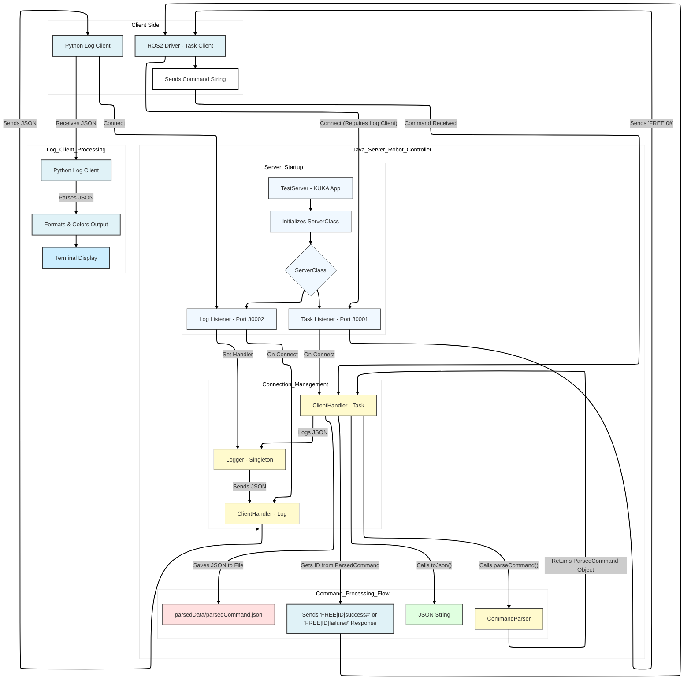

# iiwaTOFAS

A TCP/IP-based control system for KUKA iiwa robots, designed to work with the KUKA Sunrise controller. This project provides a robust communication framework that allows external clients (like ROS2 drivers) to send motion commands and receive real-time logging information from the robot.

## What This Does

This is a server application that runs on the KUKA robot controller and handles three types of connections:
- **Task Port (30001)**: Receives motion commands and control instructions
- **Log Port (30002)**: Broadcasts JSON-formatted logging data in real-time
- **Joint State Port (30003)**: Broadcasts real-time joint position data to connected clients

Think of it as a bridge between your robot control software and the KUKA hardware. Commands come in as simple string messages, get parsed into robot motions, and everything that happens gets logged back to you. Joint state data is continuously broadcast to all connected clients for monitoring and control feedback.

## Features

- Multi-threaded TCP server running on the KUKA Sunrise controller
- Support for various motion types (PTP, LIN, CIRC movements)
- Both joint-space and Cartesian-space motion commands
- Continuous motion support for smooth trajectories
- Digital and analog I/O control
- Real-time JSON logging over a dedicated connection
- **Real-time joint state broadcasting to multiple clients (100Hz)**
- Command validation and error handling
- Session management with unique client IDs
- Automatic command history saved to `parsedData/parsedCommand.json`

## Architecture

The system uses a multi-port architecture with three dedicated server ports:
- Port 30001 for task commands
- Port 30002 for log data
- Port 30003 for joint state data

The log client must be connected first before task clients can send commands - this ensures you never miss any logging information. The joint state server operates independently and accepts multiple simultaneous client connections.



## Getting Started

### Requirements

- KUKA iiwa robot with Sunrise.Workbench
- Java Development Kit (JDK) compatible with KUKA Sunrise
- Python 3.x (for the client utilities)
- Network connectivity between your control machine and the robot

### Setting Up the Server

1. Import this project into Sunrise.Workbench
2. Configure your robot's IP address in the network configuration
3. Deploy the application to your KUKA controller
4. The server will automatically start listening on:
   - Port 30001 (task commands)
   - Port 30002 (logging)
   - Port 30003 (joint state broadcasting)

### Running the Python Clients

There are three Python utilities in the `pythonUtils/` directory:

**Log Client** (start this first):
```bash
python pythonUtils/log_client.py
```

**Task Client** (for testing commands):
```bash
python pythonUtils/task_client.py
```

**Joint State Client** (for receiving real-time joint positions):
```bash
python pythonUtils/joint_state_client.py
```

You'll need to update the `SERVER_IP` in all files to match your robot's IP address.

### Receiving Joint State Data

To receive real-time joint state data from the robot, connect to port 30003. The robot broadcasts joint positions at 100Hz (10ms intervals) in the following format:

```
J1;J2;J3;J4;J5;J6;J7#
```

Where J1-J7 are the joint angles in degrees. Example Python client:

```python
import socket

SERVER_IP = "10.66.171.147"  # Robot IP
JOINT_STATE_PORT = 30003

sock = socket.socket(socket.AF_INET, socket.SOCK_STREAM)
sock.connect((SERVER_IP, JOINT_STATE_PORT))

while True:
    data = ""
    while True:
        char = sock.recv(1).decode()
        if char == '#':
            break
        data += char
    
    joints = data.split(';')
    print(f"Joint positions: {joints}")
```

Multiple clients can connect simultaneously to receive joint state updates.

## Command Protocol

Commands are sent as pipe-delimited strings ending with `#`. Here's the basic format:

```
ACTION_TYPE|NUM_POINTS|POINT_DATA|VELOCITY|ACCELERATION|JERK|ID#
```

### Supported Motion Types

| Action Type | Description | Value |
|------------|-------------|-------|
| PTP_AXIS | Point-to-point in joint space | 0 |
| PTP_FRAME | Point-to-point in Cartesian space | 1 |
| LIN_AXIS | Linear motion in joint space | 2 |
| LIN_FRAME | Linear motion in Cartesian space | 3 |
| CIRC_AXIS | Circular motion in joint space | 4 |
| CIRC_FRAME | Circular motion in Cartesian space | 5 |
| PTP_AXIS_C | Continuous PTP in joint space | 6 |
| PTP_FRAME_C | Continuous PTP in Cartesian space | 7 |
| LIN_FRAME_C | Continuous linear in Cartesian space | 8 |

### Example Commands

Move to joint position (all angles in degrees):
```
0|1|0.0;10.0;-5.0;20.0;0.0;-15.0;0.0|0.2|0.1|0.05|cmd_001#
```

Move to Cartesian position (X,Y,Z in mm, A,B,C in degrees):
```
1|1|400.0;0.0;600.0;180.0;0.0;180.0|0.15|0.1|0.05|cmd_002#
```

Linear motion with two waypoints:
```
3|2|350.0;50.0;500.0;180.0;0.0;180.0,400.0;100.0;550.0;180.0;0.0;180.0|0.1|0.08|0.03|cmd_003#
```

### I/O Commands

Digital output control:
```
9|PIN_NUMBER|STATE|ID#
```

Reading digital inputs:
```
12|PIN_NUMBER|ID#
```

## Project Structure

```
iiwaTOFAS/
├── src/
│   └── hartu/
│       ├── protocols/           # Protocol definitions and constants
│       │   └── constants/       # Action types, message formats
│       └── robot/
│           ├── commands/        # Command data structures
│           ├── communication/   # TCP server and client handlers
│           │   ├── server/      # ServerClass, JointStateServerManager, Logger
│           │   └── client/      # Client connection utilities (deprecated)
│           ├── executor/        # Robot motion execution
│           └── utils/           # Command parser, formatters
├── pythonUtils/
│   ├── log_client.py           # Receives and displays logs
│   └── sunriseBench.py         # Additional client utilities
├── parsedData/                 # Command history logs
└── FastRobotInterface_Client_Source/  # KUKA FRI SDK examples
```

## How It Works

When you connect a client to the task port:

1. The log client must already be connected (safety requirement)
2. Server sends `FREE|0#` to indicate it's ready
3. Client sends a command string
4. Server parses the command via `CommandParser`
5. Command gets validated and converted to robot instructions
6. Execution status/logs are sent to the log client in JSON format
7. Server responds with `FREE|ID|success#` on successful execution or `FREE|ID|failure#` on failure
8. Command history is saved to `parsedData/parsedCommand.json`

The logging system uses a singleton pattern to ensure all server components can log events, and everything gets broadcast to connected log clients in real-time.

### Joint State Broadcasting

The robot continuously broadcasts joint position data to all connected clients on port 30003:

1. `JointStateServerManager` starts a server socket on port 30003
2. Multiple clients can connect simultaneously
3. Every 10ms (100Hz), the current joint positions are read from the robot
4. Joint data is formatted as semicolon-separated values: `J1;J2;J3;J4;J5;J6;J7#`
5. The message is broadcast to all connected clients
6. Disconnected clients are automatically removed

## Key Classes

- **ServerClass**: Main TCP server managing task and log ports
- **JointStateServerManager**: Server that broadcasts joint positions to multiple clients
- **ClientHandler**: Handles individual client connections for tasks and logging
- **CommandParser**: Converts string commands to ParsedCommand objects
- **Logger**: Singleton that broadcasts events to log clients
- **ParsedCommand**: Validated, structured command ready for execution

## Development Notes

This project is designed to integrate with external control systems. The protocol is intentionally simple - no complex handshakes or binary formats. Just strings over TCP. This makes it easy to interface from any language or framework.

The continuous motion commands (PTP_AXIS_C, etc.) are useful when you need smooth trajectories without the robot stopping between waypoints.

Commands are validated before execution, so malformed inputs won't crash the server or damage the robot. Parse errors get logged and the connection stays open.

## Contributing

Feel free to open issues or submit pull requests. When adding new command types, make sure to:
- Add the enum to `ActionTypes.java`
- Update the parser logic in `CommandParser.java`
- Test thoroughly on actual hardware (or simulator if available)

## License

MIT License - see [LICENSE](LICENSE) file for details.

## Safety Notice

This software controls industrial robots. Always follow proper safety procedures:
- Keep the emergency stop accessible
- Test new commands in manual mode first
- Ensure the workspace is clear before running automated sequences
- Follow your organization's safety protocols for robot operation

Remember: you're responsible for how you use this code with actual hardware.
